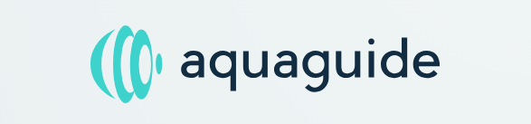

<!-- PROJECT LOGO -->
 

  

  

    Aquaguide: Empowering Blind Swimmers to Navigate Confidently
     
     
     

    
  

<!-- ABOUT THE PROJECT -->
## About The Project
Stay on Course: AquaGuide uses cutting-edge technology to help blind swimmers maintain a straight path while swimming, ensuring they stay safe and focused on their stroke.
Waterproof & Lightweight: Designed to seamlessly integrate into any swimwear, AquaGuide is lightweight and fully waterproof, so it won't interfere with your swim.
Easy to Use: With simple intuitive feedback, AquaGuide provides real-time audio cues that guide swimmers in the right direction without distractions.

### Built With

<!-- GETTING STARTED -->
## Getting Started
### Prerequisites
- Raspberry pi zero with Picamera

### Installation

1. Install opencv and rpi.gpio on raspberry pi zero
2. Clone the repo on rasp pi zero
3. Inside rasp pi, in CLI, python blackband.py

<!-- USAGE EXAMPLES -->
## Usage
Video shown for illustration on https://youtu.be/rnkZiPMfC8k

## Limitations and improvements
Simple proof of concept, Required to be tested by swimmers to fine-tune the alert

<!-- CONTACT -->
## Contact

Jackrite  - jackrite.to@gmail.com

<!-- MARKDOWN LINKS & IMAGES -->
<!-- https://www.markdownguide.org/basic-syntax/#reference-style-links -->
[contributors-shield]: https://img.shields.io/github/contributors/github_username/repo_name.svg?style=for-the-badge
[contributors-url]: https://github.com/github_username/repo_name/graphs/contributors
[forks-shield]: https://img.shields.io/github/forks/github_username/repo_name.svg?style=for-the-badge
[forks-url]: https://github.com/github_username/repo_name/network/members
[stars-shield]: https://img.shields.io/github/stars/github_username/repo_name.svg?style=for-the-badge
[stars-url]: https://github.com/github_username/repo_name/stargazers
[issues-shield]: https://img.shields.io/github/issues/github_username/repo_name.svg?style=for-the-badge
[issues-url]: https://github.com/github_username/repo_name/issues
[license-shield]: https://img.shields.io/github/license/github_username/repo_name.svg?style=for-the-badge
[license-url]: https://github.com/github_username/repo_name/blob/master/LICENSE.txt
[linkedin-shield]: https://img.shields.io/badge/-LinkedIn-black.svg?style=for-the-badge&logo=linkedin&colorB=555
[linkedin-url]: https://linkedin.com/in/linkedin_username
[product-screenshot]: images/screenshot.png
[Next.js]: https://img.shields.io/badge/next.js-000000?style=for-the-badge&logo=nextdotjs&logoColor=white
[Next-url]: https://nextjs.org/
[React.js]: https://img.shields.io/badge/React-20232A?style=for-the-badge&logo=react&logoColor=61DAFB
[React-url]: https://reactjs.org/
[Vue.js]: https://img.shields.io/badge/Vue.js-35495E?style=for-the-badge&logo=vuedotjs&logoColor=4FC08D
[Vue-url]: https://vuejs.org/
[Angular.io]: https://img.shields.io/badge/Angular-DD0031?style=for-the-badge&logo=angular&logoColor=white
[Angular-url]: https://angular.io/
[Svelte.dev]: https://img.shields.io/badge/Svelte-4A4A55?style=for-the-badge&logo=svelte&logoColor=FF3E00
[Svelte-url]: https://svelte.dev/
[Laravel.com]: https://img.shields.io/badge/Laravel-FF2D20?style=for-the-badge&logo=laravel&logoColor=white
[Laravel-url]: https://laravel.com
[Bootstrap.com]: https://img.shields.io/badge/Bootstrap-563D7C?style=for-the-badge&logo=bootstrap&logoColor=white
[Bootstrap-url]: https://getbootstrap.com
[JQuery.com]: https://img.shields.io/badge/jQuery-0769AD?style=for-the-badge&logo=jquery&logoColor=white
[JQuery-url]: https://jquery.com 
